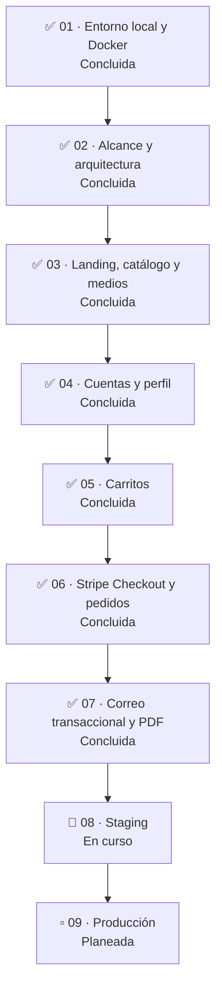

# Roadmap

Estado de implementación del [MVP aprobado](MVP_SCOPE.md). El roadmap fija la secuencia, dependencias, decisiones de planificación, resultados y comprobaciones de cada fase. Las guías de [Docker](architecture/docker/COMPOSE.md) y de [servicios externos](architecture/services/) conservan sus rutas y pasos detallados; aquí se enlazan donde se necesitan.

Las decisiones duraderas del repositorio siguen en [AGENTS.md](../AGENTS.md), el alcance en [MVP_SCOPE.md](MVP_SCOPE.md), los contratos en [contracts](contracts/) y las instrucciones de proveedor en [architecture](architecture/). Este documento organiza su aplicación por fase, sin duplicar las reglas generales.

| Fase | Resultado | Estado |
|---|---|---|
| 01 · Entorno local y Docker | Stack reproducible en Compose, con acceso local y opción LAN | Concluida |
| 02 · Alcance y arquitectura | Alcance maestro y arquitectura transversal; los contratos de módulo se detallan en sus fases | Concluida |
| 03 · Landing, catálogo y medios | Catálogo, presentación, medios y carga pública | Concluida |
| 04 · Cuentas y perfil | Registro, confirmación, sesión, recuperación y perfil | Concluida |
| 05 · Carritos | Carrito de invitado, cuenta y transferencia | Concluida |
| 06 · Stripe Checkout y pedidos | Compra, webhook firmado, pedidos e idempotencia | Concluida |
| 07 · Correo transaccional y PDF | Resend, mensajes de compra y detalle de pedido | Concluida |
| 08 · Staging | Railway, integraciones aisladas y aceptación de recorridos | En curso |
| 09 · Producción | Dominio público, medios, costos, operación y salida autorizada | Planeada |

## Secuencia

```mermaid
flowchart TB
    p01["✅ 01 · Entorno local y Docker<br/>Concluida"] --> p02["✅ 02 · Alcance y arquitectura<br/>Concluida"]
    p02 --> p03["✅ 03 · Landing, catálogo y medios<br/>Concluida"]
    p03 --> p04["✅ 04 · Cuentas y perfil<br/>Concluida"]
    p04 --> p05["✅ 05 · Carritos<br/>Concluida"]
    p05 --> p06["✅ 06 · Stripe Checkout y pedidos<br/>Concluida"]
    p06 --> p07["✅ 07 · Correo transaccional y PDF<br/>Concluida"]
    p07 --> p08["🔵 08 · Staging<br/>En curso"]
    p08 --> p09["▫️ 09 · Producción<br/>Planeada"]
```

## Plan por fases

### Cuándo se definen los contratos

La fase 02 aprueba el alcance maestro del MVP, la arquitectura transversal, las interfaces compartidas y la secuencia de dependencias. **No cierra por adelantado el comportamiento detallado de cada módulo.** Al iniciar cada fase funcional, se crea o revisa el contrato de ese módulo antes de implementar; el contrato guía su alcance y comprobaciones. Las fases 03–07 enlazan el documento correspondiente. Los contratos que hoy viven en <code>docs/contracts</code> describen el estado consolidado del proyecto: su ubicación no significa que todos se hayan definido en la fase 02. Las fases de infraestructura, como Staging y Producción, actualizan las guías de proveedor que les corresponden.

### 01. Entorno local y Docker — concluida

- **Objetivo:** permitir que una copia limpia del repositorio levante el stack de desarrollo y sus dependencias sin instalar Node.js en el equipo anfitrión.
- **Dependencias:** ninguna.
- **Resultado:** frontend Next.js, API Express, PostgreSQL, Prisma, worker y Mailpit en Docker Compose. El modo local estándar enlaza servicios al loopback; el modo LAN es opcional y reversible y cambia la publicación de puertos y las direcciones usadas por el navegador. Los medios pueden servirse localmente o desde R2 sin cambiar los puertos de Compose.
- **Comprobaciones:** reconstruir y levantar Compose desde la guía; comprobar frontend, API, base de datos, worker y recepción de correo en Mailpit. Si se usa LAN, confirmar acceso desde otro dispositivo y poder volver al modo local. La guía distingue estos modos de los Dockerfiles de producción que se preparan en la fase 08.
- **Estado y evidencia:** configuración de Compose y del modo LAN presente en el repositorio; no hay un servicio externo que preparar. La última fecha de ejecución completa no está registrada en este roadmap. Compose y su ejercicio de construcción desde cero están en [la guía maestra](architecture/docker/COMPOSE.md).

### 02. Alcance y arquitectura — concluida

- **Objetivo:** aprobar el alcance maestro del MVP y definir la arquitectura transversal: cómo se comunican navegador, frontend, API y servicios externos antes de construir los módulos.
- **Dependencias:** fase 01.
- **Resultado:** alcance maestro en [MVP_SCOPE.md](MVP_SCOPE.md), reglas duraderas en [AGENTS.md](../AGENTS.md), decisiones transversales de arquitectura y secuencia de dependencias. En producción, el navegador llama al proxy del mismo origen del frontend (<code>/api/backend/*</code>); Next.js reenvía la solicitud a Express por la red privada de Railway. Así la cookie de sesión pertenece al origen de la tienda. La API conserva un dominio público para el webhook de Stripe. En Compose, el navegador puede llamar a la API por el puerto local publicado. El comportamiento detallado de cada módulo se define o ajusta en su fase, antes de implementar ese módulo.
- **Motivo y momento de validación:** las pruebas de sesión entre dominios y en navegadores móviles hicieron visible la necesidad del proxy. Por eso la arquitectura se especifica aquí como dependencia de las cuentas y se valida al desplegar en la fase 08; Railway no exige el proxy para la comunicación privada entre servicios.
- **Comprobaciones:** <code>MVP_SCOPE.md</code>, diagramas y README describen la arquitectura de producción vigente; las guías separan las rutas locales y de producción; la API privada del navegador no se presenta como pública; cada fase funcional enlaza y revisa su contrato antes de implementar.
- **Estado y evidencia:** diseño y proxy de producción presentes en el código y la documentación; no requiere una cuenta externa propia. El recorrido autenticado se ejercitó en staging junto con una compra de prueba reportada el 29 de octubre de 2026; eso no acredita por sí solo todos los casos de sesión. La descripción de producción está en [README.md](../README.md), las rutas en [ROUTES-AND-ACCESS.md](architecture/ROUTES-AND-ACCESS.md) y los pasos de Railway en su [guía de despliegue](architecture/services/RAILWAY.md).

### 03. Landing, catálogo y medios — concluida

- **Objetivo:** implementar la landing, el catálogo y los medios dentro del alcance aprobado.
- **Dependencias:** fases 01 y 02. Antes de cargar medios reales, el responsable del proyecto prepara la cuenta y el bucket no productivo de Cloudflare R2.
- **Contrato del módulo:** revisar y cerrar [Landing completa](contracts/03-LANDING.md), que reúne catálogo y contador de visitas, antes de implementar esas capacidades.
- **Resultado:** landing, tres fichas locales de catálogo, contador de visitas, aviso de edad e imágenes con claves estables. Desarrollo puede servir los archivos localmente o desde R2; staging usa medios no productivos; producción tendrá bucket y hostname propios. `r2.dev` se reserva para desarrollo/staging y no requiere cambiar DNS. La carga del MVP es manual; la aplicación no recibe credenciales de escritura. Cada entorno necesita sus migraciones; el catálogo de demostración se carga manualmente con `backend/prisma/dev-showcase.sql`.
- **Entrega y optimización de imágenes (estado comprobado):** R2 conserva los originales PNG y la carga del MVP es manual; R2 no convierte ni redimensiona objetos. En staging/producción, los componentes que usan <code>next/image</code> pasan por el optimizador de Next.js: <code>sizes</code> permite generar anchos responsivos y Next entrega WebP cuando el navegador lo acepta. Esto sucede en el servicio Frontend y no crea variantes dentro del bucket. El hero y el fondo de la colección usan <code>&lt;picture&gt;/&lt;img&gt;</code> y descargan el PNG original directamente; no se optimizan con Next. Por eso no se debe afirmar que las doce imágenes actuales tienen el mismo tratamiento. El chat referenciado no eligió WebP/AVIF previo a la carga, transformación de Cloudflare ni otra política. La guía de [R2](architecture/services/R2.md) distingue lo implementado de esa decisión pendiente.
- **Precios del catálogo:** los importes de <code>dev-showcase.sql</code> y del ejemplo aislado de staging son los valores correctos del alcance MVP y sirven para pruebas locales y de staging. “Pendientes de aprobación” significa que el cliente aún debe confirmar los precios comerciales finales antes de habilitar ventas en producción; no significa que los precios actuales sean incorrectos para el MVP.
- **R2 y entrega pública:** revisar cuotas antes de subir más medios. La URL <code>r2.dev</code> sirve para desarrollo/staging, pero no proporciona la caché CDN; producción requiere un dominio personalizado. La guía R2 explica cuotas y alertas. La decisión de activar optimización de Cloudflare Images es independiente y sigue pendiente; no se habilita ni se contabiliza como parte de la ruta actual.

- **Presentación y entrega:** las animaciones de interfaz se resuelven con CSS donde corresponde y respetan `prefers-reduced-motion`; no se depende de archivos animados pesados si una animación CSS cubre el caso. El catálogo público usa la estrategia de renderizado, caché y metadatos descrita en [RENDERING-AND-SEO.md](architecture/RENDERING-AND-SEO.md); las rutas privadas no deben servirse desde caché pública. Stripe necesita imágenes públicas HTTPS al crear Checkout, mediante `STRIPE_MEDIA_BASE_URL` del entorno.
- **Comprobaciones:** la landing y los productos activos se muestran; las claves y metadatos resuelven el medio correcto en cada entorno; se comprueba qué imágenes usan el optimizador de Next y cuáles entregan el PNG original; no se declara optimizado un medio que evite ese optimizador; el aviso de edad funciona; la interfaz respeta movimiento reducido; se comprueba que el proveedor de pago pueda obtener las imágenes cuando se usa Checkout remoto.
- **Estado y evidencia:** landing y catálogo implementados; doce medios cargados y resueltos en el bucket de desarrollo. El código optimiza mediante Next.js sólo los componentes que usan <code>next/image</code>; el hero y el fondo de colección entregan el PNG original. La fase se registra como concluida para catálogo y entrega de medios, no como una conversión integral de imágenes. La fecha de verificación y el bucket activo deben revisarse por entorno. Para cuotas y costos, consultar [Servicios y costos](architecture/services/COSTS.md) y [Cloudflare R2](architecture/services/R2.md).

### 04. Cuentas y perfil — concluida

- **Objetivo:** ofrecer registro, autenticación, recuperación y administración del perfil.
- **Dependencias:** fases 01 y 02; las pantallas se integran con las superficies definidas en fase 03.
- **Contrato del módulo:** revisar y cerrar [Cuentas y perfil](contracts/04-ACCOUNTS-PROFILE.md) antes de implementar registro, sesión y perfil.
- **Resultado:** registro con validación de mayoría de edad y dirección; confirmación de correo; inicio, cierre y restauración de sesión; recuperación de contraseña; edición de nombre(s), apellidos, correo, fecha de nacimiento y dirección; perfil y Mis pedidos, conectado a órdenes reales en la fase 06. Los datos de cuenta se guardan en PostgreSQL. Las cuentas nuevas permanecen pendientes hasta consumir el enlace; un cambio de correo sólo se aplica tras confirmar el nuevo destino. Confirmar puede iniciar sesión y, si la persona venía de comprar, retomar el carrito y el resumen de compra.
- **Correo local:** probar mensajes de cuenta con el worker y Mailpit en Compose. El envío desde un dominio real se prepara en la fase 07; no se requiere Resend para desarrollar las cuentas localmente.
- **Sesión y estados de interfaz:** producción usa el proxy del frontend definido en fase 02 para conservar la cookie bajo el origen de la tienda. Comprobar confirmación e inicio desde otro dispositivo; no asumir que confirmar correo en un dispositivo inicia sesión en otro. Si se abandona la vista de revisión de correo y se vuelve al login, la interfaz debe reflejar el estado real de la cuenta y permitir iniciar sesión después de confirmarla, sin conservar un mensaje de registro obsoleto.
- **Comprobaciones:** registro pendiente y confirmado, login, restauración, recuperación, cambio de correo confirmado, validaciones del backend, estados de carga/error/sesión vencida y privacidad de contraseñas y tokens. En Compose verificar los mensajes en Mailpit.
- **Estado y evidencia:** código y suites de backend, frontend y navegador registrados como concluidos; la verificación histórica también informó ESLint, build de producción y mensajes recibidos en Mailpit. Su fecha no está registrada aquí y esa constancia no representa una ejecución nueva. El estado actual de Resend no es dependencia de esta fase. El contrato de [cuentas y perfil](contracts/04-ACCOUNTS-PROFILE.md) detalla rutas y casos.

### 05. Carritos — concluida

- **Objetivo:** permitir preparar una compra como invitado o con cuenta y fusionar ambos carritos al iniciar sesión.
- **Dependencias:** fases 03 y 04.
- **Contrato del módulo:** revisar y cerrar [Carritos](contracts/05-CARTS.md) antes de implementar el carrito persistente y la fusión de carritos. La integración del pago con Stripe se especifica en el contrato de la fase 06.
- **Resultado:** carrito de invitado persistido en el navegador por 30 días y carrito de cuenta en PostgreSQL. La transferencia suma cantidades de forma idempotente; el backend calcula precios actuales. Los productos inactivos se pueden quitar, pero no comprar. No se reservan ni verifican existencias.
- **Sincronización con Checkout:** al confirmar un pago, el webhook elimina sólo las líneas que coinciden con la instantánea comprada. Si la persona cambia el carrito mientras Stripe Checkout está abierto, esos cambios se conservan. Esta dependencia se implementa y valida junto al flujo de pago de la fase 06.
- **Comprobaciones:** reintentar la fusión no duplica cantidades, un error conserva el carrito local, se muestra un único carrito y Checkout rechaza productos inactivos o precios inválidos.
- **Estado y evidencia:** código y recorridos del carrito registrados como concluidos; no requieren servicio externo. La fecha de la última verificación no está registrada aquí. La confirmación del pago y la limpieza segura del carrito se especifican en el [contrato de Checkout](contracts/06-CHECKOUT-ORDERS.md).

### 06. Stripe Checkout y pedidos — concluida

- **Objetivo:** aceptar pagos alojados por Stripe y confirmar las compras sólo mediante webhooks firmados.
- **Dependencias:** fases 03, 04 y 05.
- **Contrato del módulo:** revisar y cerrar [Checkout y pedidos](contracts/06-CHECKOUT-ORDERS.md) antes de implementar pagos, webhooks y órdenes.
- **Stripe local:** primero probar en modo de prueba desde Compose con Stripe CLI y un túnel hacia el endpoint local. Reenviar sólo los eventos que procesa la aplicación y usar el `whsec_…` entregado por esa sesión local. Las instrucciones y el comando vigente están en [Stripe](architecture/services/STRIPE.md).
- **Resultado:** el servidor vuelve a validar disponibilidad y precios, crea una instantánea pendiente y abre Stripe Checkout. El webhook firmado confirma pagos, guarda la orden histórica y limpia las líneas compradas de forma idempotente. Sólo se muestran pedidos pagados a su titular. El resumen permite cambiar el destinatario sin alterar el perfil, consultar datos seguros de tarjetas guardadas y volver a pedir. No se almacena el número completo ni el CVC de la tarjeta.
- **Stripe en staging:** al desplegar en la fase 08, crear en el dashboard de Stripe un webhook HTTPS dirigido al dominio público de la API y `/api/webhooks/stripe`. Configurar los eventos documentados y guardar su secreto `whsec_…` en el backend de staging. Las claves y secretos de staging no se comparten con el túnel ni con producción.
- **Comprobaciones:** precios y disponibilidad vigentes, firma válida e inválida, eventos repetidos, estado pagado determinado por webhook y no por el retorno del navegador, orden visible en Mis pedidos y limpieza del carrito sin perder ediciones realizadas durante Checkout.
- **Estado y evidencia:** fase concluida. Se informó una compra de prueba exitosa en staging con Stripe el 29 de octubre de 2026. Producción sigue pendiente. El [contrato de Checkout y pedidos](contracts/06-CHECKOUT-ORDERS.md) especifica los eventos, la instantánea y la idempotencia.

### 07. Correo transaccional y PDF — concluida

- **Objetivo:** entregar mensajes de cuenta y una confirmación de compra con un único PDF de detalle del pedido.
- **Dependencias:** fase 04 para mensajes de cuenta y fase 06 para pedidos pagados. Antes de habilitar envíos desde un dominio propio, el responsable del proyecto crea la cuenta de Resend y prepara el dominio de envío en el DNS autoritativo de Neubox/cPanel.
- **Contrato del módulo:** precisar el correo de cuenta en [Cuentas y perfil](contracts/04-ACCOUNTS-PROFILE.md) y el correo de compra/PDF en [Checkout y pedidos](contracts/06-CHECKOUT-ORDERS.md#correo-de-compra-y-comprobantes) antes de implementar su entrega. La integración y los límites del proveedor se documentan en la guía [Resend](architecture/services/RESEND.md).
- **07.1 · Verificar el flujo local:** probar registro, recuperación y compra desde Compose; Mailpit debe recibir tanto correo de cuenta como de compra y el correo de compra debe incluir el PDF. Confirmar reintentos, tratamiento de fallos e idempotencia sin depender de un proveedor remoto.
- **07.2 · Preparar dominio y remitentes:** añadir en el Zone Editor los registros exactos que muestre Resend para el dominio elegido (`mail.srmictlan.com` en esta instalación), comprobar la verificación y preservar los MX y registros de otros servicios. No usar la sección de child nameservers para crear TXT/CNAME/MX ni cambiar toda la delegación DNS para verificar un registro. La guía de [Neubox y cPanel](architecture/services/NEUBOX.md) explica la zona autoritativa.
- **07.3 · Revisar capacidad de envío:** el plan Free vigente de Resend incluye hasta 3,000 correos al mes y 100 al día, sin requerir datos de facturación. La ausencia de solicitud de tarjeta es compatible con ese plan; se debe confirmar el plan actual en la cuenta, no inferirlo sólo por el formulario de alta. Confirmación, recuperación y compras comparten esos límites. En planes pagados, los sobreconsumos transaccionales se habilitan aparte y se cobran en bloques de 1,000 usando la tarjeta registrada. No habilitar sobreconsumos ni introducir una tarjeta sin presupuesto aprobado. La [guía de Resend](architecture/services/RESEND.md) explica la comprobación y el comportamiento vigente.

- **Resultado:** PostgreSQL persiste un solo trabajo de confirmación por pedido pagado y el worker lo procesa. En Compose el worker usa SMTP hacia Mailpit; en Railway usa la API HTTPS de Resend. La clave pertenece al Worker y se separa por entorno. `MAIL_FROM` se usa para mensajes de cuenta y `RESEND_FROM` para compras; verificar envío no crea por sí mismo un buzón para recibir respuestas. No se añade otro broker a la cola persistida. El worker registra tipo de trabajo, intento e error sin volcar destinatarios, domicilios ni contenido del mensaje.
- **Comprobaciones:** dominio verificado, remitentes autorizados, enlaces con el origen del entorno correcto, mensaje visible en Resend y en la bandeja destino, PDF con el detalle correcto y trabajo recuperable ante fallos. No guardar claves en el repo ni configurarlas como `SMTP_PASSWORD`.
- **Estado y evidencia:** código de Resend y PDF implementado; configuración de staging y recepción de mensajes de cuenta y compra reportadas. Para la cabecera del correo se decidió usar la imagen de marca en vez de depender de Cinzel, que no se renderizaba de forma fiable en Gmail; el cambio quedó en el commit `488d78b` del 29 de octubre de 2026. La cola implementa reintentos y deduplicación. La recepción del correo de compra está reportada para esa misma fecha. La aceptación de producción corresponde a la fase 09. Las instrucciones de cuenta, dominio y Worker están en [Resend](architecture/services/RESEND.md); el contenido del PDF y la cola están en el [contrato de Checkout](contracts/06-CHECKOUT-ORDERS.md#correo-de-compra-y-comprobantes).

### 08. Staging — en curso

- **Objetivo:** desplegar y aceptar la aplicación en servicios no productivos que reproduzcan la arquitectura de producción.
- **Dependencias:** fases 01–07; cuenta Railway del responsable del proyecto, PostgreSQL de staging, Dockerfiles de producción, bucket de medios no productivo, claves de Stripe de prueba y configuración de Worker/Resend de staging. Confirmar que los Dockerfiles estén versionados antes de crear los servicios.
- **08.1 · Crear servicios Railway:** configurar `postgres`, `api`, `worker` y `frontend` por separado. Usar `backend/Dockerfile.production` para API y Worker y `frontend/Dockerfile.production` para Next.js; ejecutar migraciones desde el servicio API. La guía indica raíz, comandos, health check, red privada y variables. `INTERNAL_API_URL` permite que Next.js use la URL privada de la API; su dominio público recibe el webhook. No desplegar Mailpit.
- **08.2 · Aislar proveedores y medios:** cada servicio conserva variables y secretos propios de staging. Usar webhook HTTPS de Stripe con su propio secreto, bucket/hostname no productivo y remitentes de Resend verificados. Los dominios públicos de Railway bastan para iniciar; Cloudflare DNS/TLS para un dominio de staging sólo se configura si ese dominio está disponible y se necesita.
- **08.3 · Revisar el consumo de Railway:** inspeccionar el control de uso a nivel del workspace y dejar documentado si existen alerta suave y límite duro. El umbral se decide según presupuesto aprobado; no asignarlo por intuición. El límite duro puede apagar todos los workloads del workspace. La [guía Railway](architecture/services/RAILWAY.md) describe el alcance y el comando de consulta.
- **08.4 · Completar controles del MVP:** Turnstile aún no está implementado. Añadirlo en los formularios incluidos por el alcance y validar tokens en el servidor con Siteverify; probar tokens válidos, ausentes e inválidos antes de dar por aceptado ese recorrido.
- **Comprobaciones de recorrido completo:** desde móvil y escritorio, registrar, recibir y consumir confirmación, iniciar sesión, recuperar contraseña, consultar catálogo/imágenes, preparar carrito, pagar con Stripe de prueba, confirmar por webhook, comprobar que se limpia sólo lo comprado y recibir el correo con PDF. Revisar también errores de consola y solicitudes; una prueba de compra aislada no acredita todos estos recorridos.
- **Estado y evidencia:** servicios desplegados y compra de prueba con recepción del correo de compra reportadas para el 29 de octubre de 2026. El estado actual de variables, dominios y servicios debe verificarse en Railway; no se deduce del repositorio. Turnstile sigue pendiente, así que la aceptación de staging no está completa. Los pasos reproducibles están en [Railway](architecture/services/RAILWAY.md), [Stripe](architecture/services/STRIPE.md), [Resend](architecture/services/RESEND.md) y [R2](architecture/services/R2.md).

### 09. Producción — planeada

- **Objetivo:** preparar el entorno real, su dominio público, operación y costos antes de autorizar la salida.
- **Dependencias:** aceptación de staging, cuenta y recursos de producción, dominio disponible y preparación por el responsable del proyecto de credenciales distintas para Stripe, Resend, Railway y R2.
- **09.1 · Preparar Railway y medios:** crear servicios y PostgreSQL separados de staging, aplicar migraciones, verificar catálogo, configurar Worker/Resend, claves de Stripe live y bucket de producción. Confirmar con el cliente los precios comerciales finales antes de habilitar cobros reales; los precios actuales del MVP sólo autorizan pruebas. La URL de medios debe ser pública y HTTPS para Stripe; no usar <code>r2.dev</code> en producción.
- **09.2 · Decidir la capa pública de Cloudflare:** decidir si Cloudflare administrará DNS, proxy/CDN y el hostname personalizado de medios. R2 y la zona DNS son recursos distintos: usar R2 en desarrollo o staging no requiere cambiar nameservers. Si se migra la zona, inventariar y conservar antes los registros web, MX, SPF, DKIM, DMARC y verificaciones; cambiar la delegación desde Neubox afecta toda la zona. Probar TLS, tienda, webhook, imágenes y políticas de caché antes de habilitar el tráfico. Seguir [Neubox](architecture/services/NEUBOX.md), [Cloudflare](architecture/services/CLOUDFLARE.md) y [R2](architecture/services/R2.md).
- **09.3 · Revisar cuotas, límites y costos antes de habilitar tráfico:**
  - **R2:** contrastar almacenamiento y operaciones con la cuota Standard vigente; el egreso de R2 es gratuito. La alerta de presupuesto de Cloudflare es a nivel de cuenta y sólo notifica: no detiene el consumo ni fija un máximo para R2.
  - **Cloudflare Images, sólo si se elige:** sus transformaciones son un producto separado de R2/CDN. El plan Free permite 5,000 transformaciones únicas al mes; al excederlas, las transformaciones nuevas pueden fallar. No está configurado en este proyecto.
  - **Railway:** revisar los límites del workspace. La alerta suave envía correo; el límite duro de cómputo apaga todos los workloads del workspace al alcanzarse. Seleccionar ambos importes con el presupuesto aprobado y considerar que Staging y Production comparten el efecto si están en el mismo workspace.
  - **Resend:** comparar el volumen diario y mensual de confirmación, recuperación y compras con el plan de la cuenta. Free no requiere tarjeta y limita el envío a 3,000/mes y 100/día; el sobreconsumo sólo existe como opción en planes pagados y puede generar cargos automáticos.
  - **Stripe:** el modo de prueba no procesa pagos reales. En Standard, Stripe cobra por transacción exitosa; los límites de solicitudes API limitan la tasa de llamadas, no el gasto o las ventas. No hay un tope de gasto configurado por esta integración. Si el negocio necesita un límite de ventas, debe definirse como regla del negocio antes de producción.
  - Registrar los umbrales y el responsable sólo después de revisar los paneles actuales y aprobar un presupuesto. La tabla y los enlaces oficiales están en [Servicios y costos](architecture/services/COSTS.md); cada guía de proveedor contiene sus controles.

- **09.4 · Preparar operación y salida:** configurar copias de seguridad y comprobar recuperación, monitoreo, responsables de secretos, respuesta a fallos y procedimiento de rollback. Completar dominio canónico, metadatos, `robots.txt` y `sitemap.xml` antes de abrir el sitio a indexación, según [RENDERING-AND-SEO.md](architecture/RENDERING-AND-SEO.md).
- **Comprobaciones:** repetir en producción las integraciones críticas con las credenciales y recursos de ese entorno; verificar correo, imágenes y enlaces bajo dominio final; revisar restauración y costos; obtener autorización explícita antes de habilitar ventas.
- **Estado y evidencia:** planeada. El repositorio no versiona la configuración privada de Railway, DNS/TLS ni secretos; el estado de cuentas y proveedores debe verificarse en cada panel. No se ha registrado una salida a producción.
